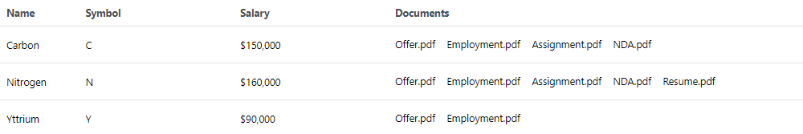
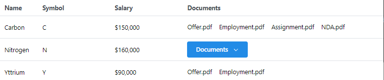
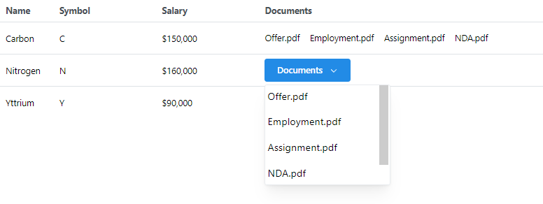
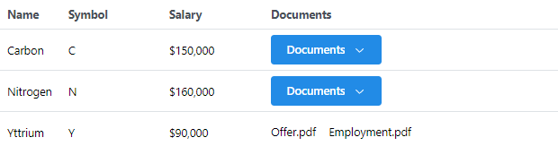
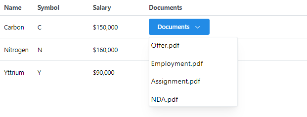

## Code challenge
This project was built using React/Next/TypeScript/Mantine Libraries. 
Have used Mantine elements like Table, Group, Stack, and Menu.

# Install
- run the following command
```bash
$ npm install
```

# Run 
```bash
npm run dev
```

# Result Screens
- Full screen mode. 


- When the screen is not wide enough to show the longest row. 


- Chevron icon expanded and showing a list vertically. Also has a scrollbar since it has more than 4 div elements.


- Showing different breakpoints depending on the length of each row.(Requirement #3)


- No scrollbar since there are 4 elements.

